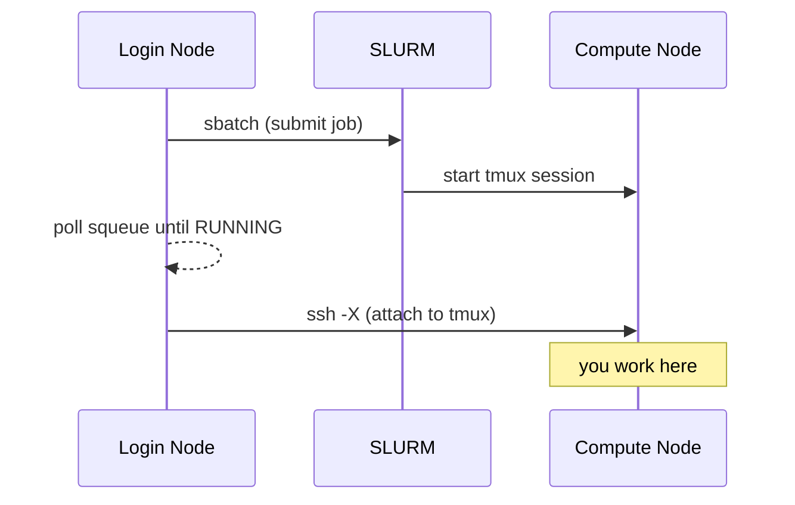

# Interactive Sessions with `sinteractive`

The `sinteractive` script launches a persistent interactive session on a compute node using tmux. It's located at [`scripts/sinteractive`](https://github.com/rnabioco/bodhi-docs/blob/main/scripts/sinteractive) in this repository.

## Why use `sinteractive` instead of `srun --pty bash`?

| | `srun --pty bash` | `sinteractive` |
|---|---|---|
| Survives SSH disconnects | No — session is lost | Yes — tmux keeps it alive |
| Multiple terminal panes | No | Yes — tmux split/window support |
| X11 forwarding | Manual setup | Automatic on connect (`ssh -X`) |
| Reconnect to session | Not possible | `sinteractive --attach JOBID` |

!!! tip "When to use which"
    Use `srun --pty bash` for quick, throwaway interactive work. Use `sinteractive` when you need a session that persists through network interruptions or when you want tmux features like split panes.

## Installation

```bash
make install
```

This copies the script to `~/.local/bin/`. Make sure `~/.local/bin` is in your `$PATH` (add `export PATH="$HOME/.local/bin:$PATH"` to your `~/.bashrc` if needed).

To install to a different location:

```bash
make install PREFIX=~/bin
```

## Usage

```bash
sinteractive [OPTIONS] [SBATCH_ARGS...]
```

### Options

| Option | Description | Default |
|---|---|---|
| `--node NODE` | Request a specific compute node | any available |
| `--partition PART` | SLURM partition | `interactive` |
| `--time TIME` | Wall time limit (supports `8h`, `30m`, `1d12h`, …) | `1 day` |
| `-j`, `--threads N` | Number of CPUs (alias for `--cpus-per-task`) | `2` |
| `-m`, `--mem SIZE` | Memory | `8G` |
| `--mouse` | Enable tmux mouse support (scroll, click panes, drag to resize) | off |
| `--no-mouse` | Disable mouse support (overrides `SINTERACTIVE_MOUSE`) | |
| `-a`, `--attach JOBID` | Reattach to a running session | |
| `-l`, `--list` | List running sinteractive sessions | |
| `-h`, `--help` | Show help message | |

All other arguments are passed directly to `sbatch`, so you can use any `sbatch` option.

### Environment variables

Set personal defaults in your `~/.bashrc`; explicit flags always win.

| Variable | Description | Default |
|---|---|---|
| `SINTERACTIVE_TIME` | Default wall time (e.g. `8h`, `2d`) | `1 day` |
| `SINTERACTIVE_PARTITION` | Default partition | `interactive` |
| `SINTERACTIVE_CPUS` | Default CPU count | `2` |
| `SINTERACTIVE_MEM` | Default memory (e.g. `16G`) | `8G` |
| `SINTERACTIVE_MOUSE` | `on`/`1`/`true`/`yes` enables mouse support | off |

```bash
# Example: always use mouse mode and a bigger default allocation
export SINTERACTIVE_MOUSE=on
export SINTERACTIVE_MEM=16G
export SINTERACTIVE_CPUS=4
```

### Examples

```bash
# Default: 1-day session, 2 CPUs, 8G memory
sinteractive

# Run on a specific node
sinteractive --node compute01

# 2-hour session on the rna partition
sinteractive --time=2:00:00 --partition=rna

# Override default memory and CPUs
sinteractive --mem=16G --cpus-per-task=4

# GPU session
sinteractive --partition=gpu --gpus=1 --mem=16G

# Longer session on the normal partition (up to 3 days)
sinteractive --time=1-12:00:00 --partition=normal
```

## How it works

1. **Submits a batch job** — `sbatch` launches the script itself on a compute node, where it starts a tmux session.
2. **Waits for the job to start** — polls `squeue` every 5 seconds until the job is running (you'll see dots printed while waiting).
3. **Connects via SSH** — once running, it SSHs into the compute node with X11 forwarding (`-X`) and attaches to the tmux session.
4. **Stays alive until you exit** — the SLURM job remains running as long as the tmux session exists. Detaching (`Ctrl-b d`) or losing your SSH connection leaves the job running so you can reconnect. Exiting tmux (`exit`) ends the job.



## Reconnecting after a disconnect

If your SSH connection drops or you intentionally detach (`Ctrl-b d`), the tmux session **keeps running** on the compute node and your work is safe. To reconnect from the login node:

```bash
# List your running sessions
sinteractive --list
#   JOBID       NAME                  NODE            PARTITION     ELAPSED     TIMELIMIT   CWD
#   12345       rna-seq               compute01       cpu           01:23:45    1-00:00:00  ~/projects/rna-seq

# Reattach
sinteractive --attach 12345
```

!!! info "This is the key advantage over `srun --pty bash`"
    With `srun`, a dropped SSH connection kills your session and any running processes. With `sinteractive`, you just reconnect and pick up where you left off.

!!! note "X11 after reattaching"
    X11 forwarding is set up on the **initial** connection (`ssh -X`). Reattaching with `--attach` reconnects through Slurm (`srun`) rather than a new `ssh -X`, so GUI apps launched **after** a reattach won't have a working `DISPLAY`. If you need X11, keep the original connection, or start a fresh session for GUI work.

## Tips

### Basic tmux commands

| Action | Key |
|---|---|
| Show help popup (job info, keys) | `Ctrl-b h` |
| Detach from session | `Ctrl-b d` |
| Split pane horizontally | `Ctrl-b "` |
| Split pane vertically | `Ctrl-b %` |
| Switch between panes | `Ctrl-b arrow-key` |
| Scroll up | `Ctrl-b [` then arrow keys (press `q` to exit) |

!!! tip "Mouse support"
    Start with `sinteractive --mouse` to scroll with the wheel, click to switch
    panes, and drag borders to resize. Mouse mode captures terminal selection,
    so hold **Shift** when you want to select text for an OS-level copy (tmux's
    own mouse selection is copied out over SSH automatically).

### Cancelling the job

Exiting the tmux session (type `exit` or `Ctrl-d` in all panes) automatically cancels the SLURM job. You can also cancel it directly:

```bash
scancel <JOBID>
```

!!! warning "Wall time"
    `sinteractive` defaults to a **1 day** wall time on the `interactive` partition. For longer sessions, switch to the `normal` partition (up to 3 days): `sinteractive --partition=normal --time=2-00:00:00`.

!!! info "Job limit"
    The `interactive` partition limits each user to **3 concurrent jobs**. If you need more simultaneous sessions, use the `normal` partition.
